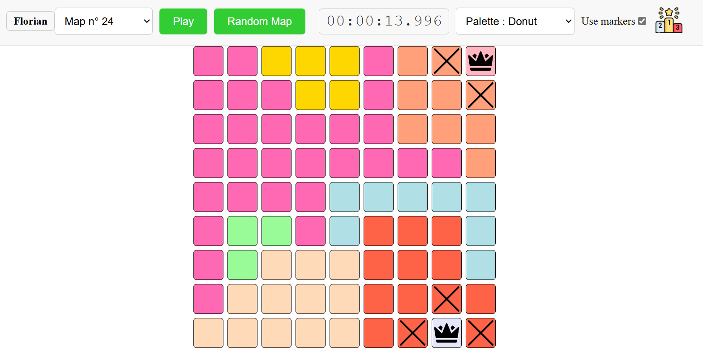

# QueensGame

homemade game inspired by linkedin game : **Queens**
see more here : https://www.linkedin.com/games/queens/

### Example of the project

# How to play

## Online
here : https://mr-donot.github.io/QueensGame/

##Offline
- download the project
- open index.html
- Enjoy the game !

# Generate new maps

- In the "main.py" file, change the value of the constant "NB_TO_GENERATE" to your desire
- run the "main.py" file
- refresh the index.html opened in your browser, the new maps will be added to the scrolling box
